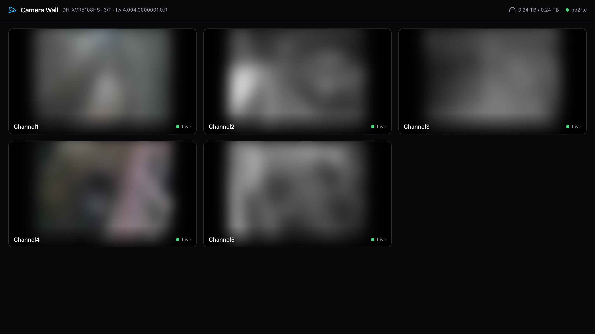

# 📹 Dahua Web Viewer

A modern, dark-mode web UI for watching your Dahua DVR/XVR cameras from a browser
on your local network.

**No cloud. No port forwarding. No accounts. No monthly costs.**
Everything runs on your own machine; camera credentials never leave it.

Built as a lightweight alternative to SmartPSS / the DVR's built-in web page for
day-to-day viewing — sub-second latency via WebRTC, with zero video transcoding.


*The camera wall (live feeds blurred for privacy).*

## Features

- **Camera wall** — responsive dark grid of all channels (low-bandwidth sub-streams)
- **Single-camera view** — full-quality main stream with:
  - scroll-wheel zoom + drag pan (double-click to reset)
  - audio toggle
  - snapshot download (full-quality JPEG straight from the DVR)
  - native fullscreen
- **Live status** — per-tile connection state, device model, firmware and HDD usage in the header
- **Channel names, resolutions, codecs and bitrates** pulled live from the DVR — rename a
  camera on the DVR and it updates here
- **Graceful degradation** — the app runs and explains itself even before credentials are configured
- **Background service mode** (macOS) — starts at login, no terminal needed, auto-restarts

## How it works

```
Browser ── React SPA
   │ /api                            │ WebRTC media (:8555)
   ▼                                 ▼
Node backend (Fastify, localhost) ──► go2rtc (localhost, bundled binary)
   │ Dahua CGI (digest auth)          │ RTSP over TCP
   └───────────► Dahua DVR/XVR  ◄─────┘
```

- **[go2rtc](https://github.com/AlexxIT/go2rtc)** (bundled via the `go2rtc-static`
  npm package — nothing to install) pulls RTSP from the DVR and repackages it to
  WebRTC. H.264 **and H.265** pass through untouched; modern browsers with
  hardware HEVC decode (Safari, Chrome on Apple Silicon) play H.265 over WebRTC
  directly, so CPU usage stays near zero.
- The **backend** owns the DVR credentials: it generates go2rtc's config at
  startup (into the git-ignored `.runtime/`), supervises the process, proxies
  the WebRTC handshake, and wraps the Dahua CGI API (snapshots, channel titles,
  encode settings, device/HDD info) with HTTP digest auth.
- The **frontend** (React 19, Vite, TanStack Router/Query, Tailwind 4) talks only
  to the backend — no credentials, no RTSP URLs, and no go2rtc API ever reach the
  browser.

The design principle is **integration over duplication**: live streams, snapshots,
names and health all come from interfaces the DVR already exposes (RTSP, CGI,
ONVIF). The DVR's own web UI remains the admin console for configuration. See
[docs/INVESTIGATION.md](docs/INVESTIGATION.md) for the full capability
investigation (HTTP/HTTPS/RTSP/ONVIF/CGI) that led to this architecture. Deferred
product and technical decisions are tracked in
[docs/OPEN_QUESTIONS.md](docs/OPEN_QUESTIONS.md).

## Requirements

- Node.js ≥ 20
- A Dahua DVR/XVR reachable on your LAN (tested with a DH-XVR5108HS-I3/T,
  firmware 4.004, 2025) — most Dahua and Dahua-OEM (Amcrest, Lorex…) recorders
  and IP cameras use the same RTSP/CGI interfaces
- The DVR's **local** username and password (usually `admin` + device password —
  *not* a DMSS/Imou cloud account)

## Quick start

```sh
git clone https://github.com/elfifo4/dahua-web-viewer.git
cd dahua-web-viewer
npm install
cp .env.example .env    # edit: DVR_HOST, DVR_USER, DVR_PASS, DVR_CHANNELS
npm run dev
```

Open http://localhost:5173 — you should see your cameras live.

> ⚠️ Dahua devices lock the account for several minutes after ~5 failed logins.
> If unsure of the password, verify it once against the DVR's own web page first.

## Run as a background service (macOS)

```sh
./scripts/install-launch-agent.sh
```

Builds the app and registers a LaunchAgent that starts at login, runs with no
terminal, and restarts itself if it crashes. The viewer is then always available
at `http://localhost:<SERVER_PORT>` (default **8787**).

- Logs: `.runtime/agent.log` / `.runtime/agent-error.log`
- After changing code or `.env`: re-run the script (it rebuilds and reloads)
- Uninstall:
  `launchctl bootout gui/$(id -u)/com.eladfinish.dahua-viewer && rm ~/Library/LaunchAgents/com.eladfinish.dahua-viewer.plist`

Dev mode (`npm run dev`, hot reload on :5173) can run alongside the service —
the Vite proxy reads `SERVER_PORT` from `.env`.

Idle cost is ~0% CPU / ~75 MB RAM; go2rtc only pulls video from the DVR while
someone is actually watching.

## Configuration

All settings live in the repo-root `.env` (see [.env.example](.env.example)):

| Variable | Default | Meaning |
|---|---|---|
| `DVR_HOST` | `192.168.1.100` | DVR IP on your LAN |
| `DVR_HTTP_PORT` / `DVR_RTSP_PORT` | `80` / `554` | DVR service ports |
| `DVR_USER` / `DVR_PASS` | — | **Local** DVR account |
| `DVR_CHANNELS` | `5` | Number of camera tiles |
| `SERVER_PORT` | `8787` | Backend + web UI port |
| `SERVER_HOST` | `127.0.0.1` | `0.0.0.0` opens the viewer to your LAN (see below) |
| `GO2RTC_API_PORT` / `GO2RTC_WEBRTC_PORT` | `1984` / `8555` | go2rtc internals |
| `GO2RTC_BIN` | *(bundled)* | Optional path to your own go2rtc build |

## Scripts

| Command | What it does |
|---|---|
| `npm run dev` | Backend (tsx watch) + frontend (Vite) with hot reload |
| `npm run build` | Typecheck + production build of both apps |
| `npm run typecheck` | Strict TypeScript check across workspaces |
| `npm start` | Run the built backend (serves the built frontend too) |

## Project layout

```
apps/server/   Fastify + TypeScript backend
  src/config.ts             .env loading + validation (zod)
  src/dahua/digest.ts       HTTP digest auth for fetch()
  src/dahua/cgi.ts          typed Dahua CGI client (device, channels, encode, storage, snapshot)
  src/go2rtc/supervisor.ts  go2rtc config generation + process supervision + WHEP proxy
  src/routes.ts             the REST API consumed by the frontend
apps/web/      React frontend
  src/lib/webrtc.ts         minimal WHEP client (SDP exchange via the backend)
  src/components/           CameraTile, VideoPlayer, FullscreenCamera, Header
docs/          DVR investigation report + open technical decisions
scripts/       LaunchAgent installer (macOS service mode)
```

## Watching from other devices on your network

By default everything binds to `127.0.0.1` (this machine only). To watch from a
phone or another computer on your home network, set in `.env`:

```
SERVER_HOST=0.0.0.0
```

restart the app (or re-run the install script), and open
`http://<machine-name>.local:8787` — e.g. `http://my-macbook.local:8787` — or
`http://<the-machine's-LAN-IP>:8787` from any device on the same Wi-Fi.
The `.local` name (Bonjour/mDNS) survives router IP reshuffles; the raw IP may
change unless you give the machine a DHCP reservation.

Notes:
- WebRTC media flows directly from go2rtc (port 8555), which already listens on
  all interfaces; no extra configuration needed.
- macOS may ask "Allow node to accept incoming connections?" the first time —
  approve it (or add node under System Settings → Network → Firewall).
- **There is no login screen.** Anyone on your Wi-Fi can view the cameras while
  this is enabled — only use it on a network you trust, and never port-forward
  it to the internet.

## Security model

- Everything binds to `127.0.0.1` — nothing is reachable from other machines,
  let alone the internet.
- DVR credentials live only in `.env` (git-ignored) and the generated
  `.runtime/go2rtc.yaml` (git-ignored, mode 600).
- The browser receives stream *names* only; the backend performs the digest
  authentication and the WebRTC handshake proxying.

## Troubleshooting

- **"Stream engine offline"** — go2rtc isn't running; check credentials in
  `.env` and the `[go2rtc]` lines in the server log.
- **Tiles stay "Offline"** — verify RTSP manually:
  `ffprobe "rtsp://USER:PASS@<DVR_IP>:554/cam/realmonitor?channel=1&subtype=1"`
  and remember: local DVR account, not the DMSS cloud login.
- **Black video on H.265 mains** — your browser may lack HEVC WebRTC decode
  (e.g. older Chrome on Intel). The grid uses sub-streams; for fullscreen either
  switch that channel's main stream to H.264 in the DVR (Camera → Encode) or use
  Safari.
- **Wrong device shown / auth errors after edits** — the server reads `.env`
  only at startup; restart `npm run dev` or re-run the install script.

## License

MIT
